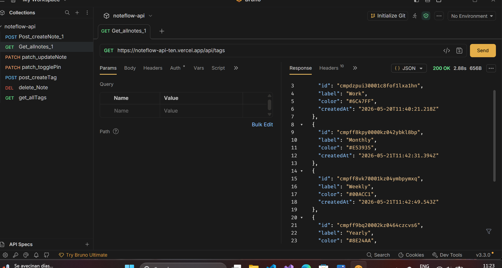
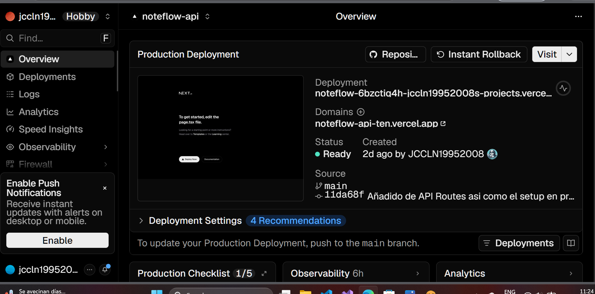
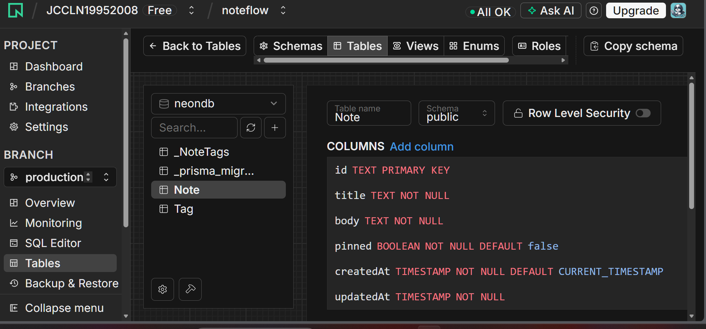
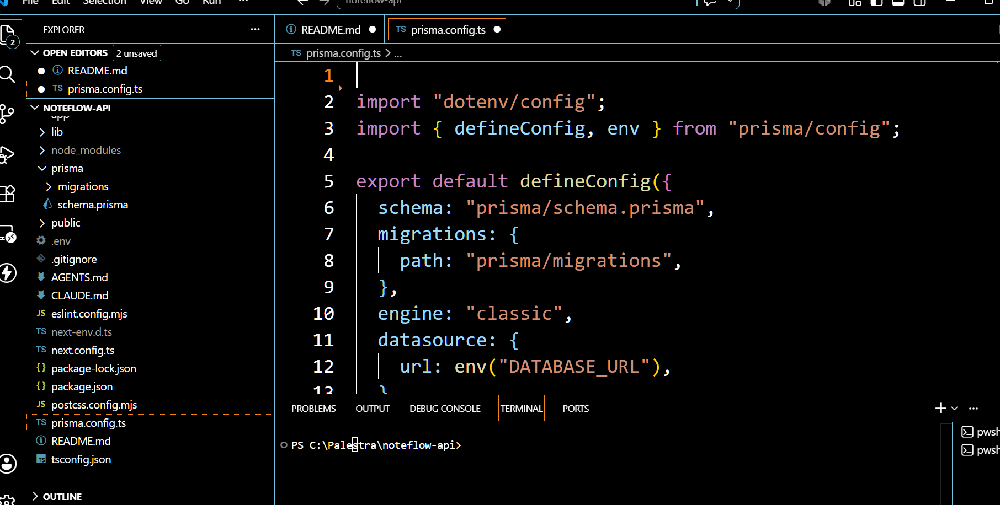
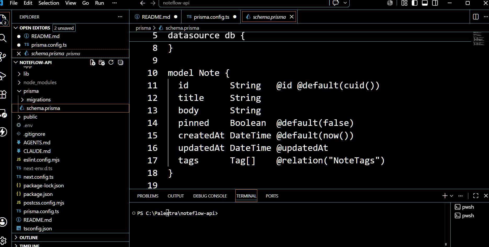
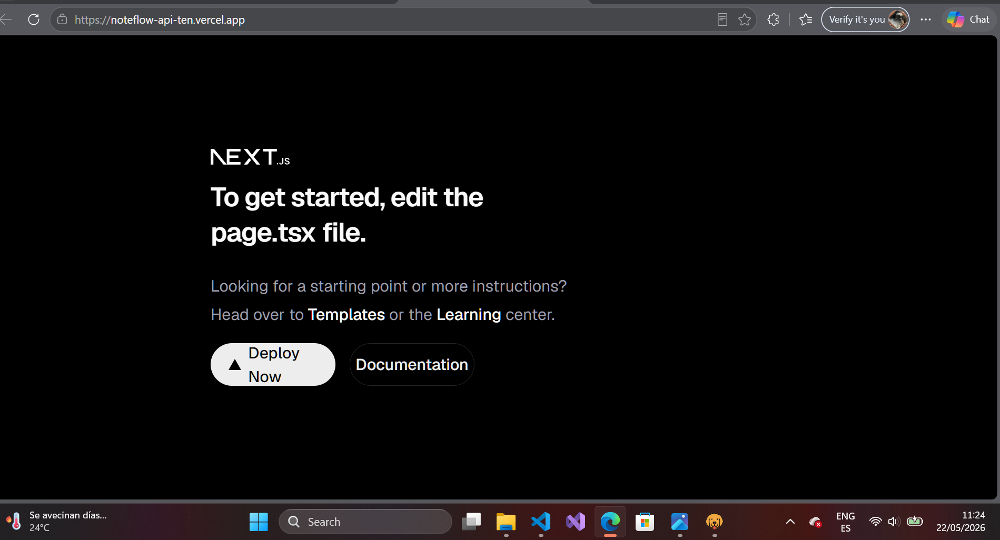
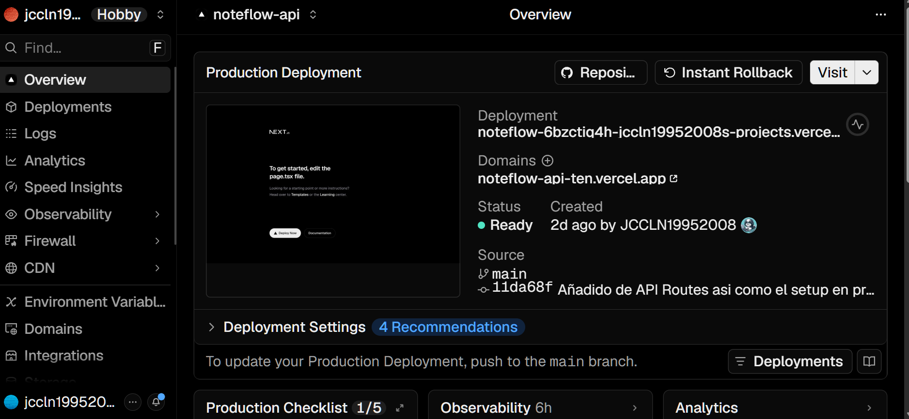

# NoteFlow API

Este es el Back-End para las REST APIs que componen la parte no visible de NoteFlow, desarrollado en reposiotrio separado del original que aloja la aplicacion, desarrollada de manera nativa para Android. Se ha desarrollado con  Next.js API Routes, Prisma, y una base de datos Neon empleando  PostgreSQL.Despliegue realizado en Vercel.

**Notion Pages**
https://www.notion.so/NoteFlow-API-Setup-368d747a11da806c8049f1cce1683419?source=copy_link

https://www.notion.so/NoteFlow-API-Dev-Log-368d747a11da803395aae49c8cfb7800?source=copy_link


---

## Tech Stack

| Herramienta | Proposito |
|---|---|
| Next.js 16 (App Router) | Entorno para API Routes |
| Prisma | Mapeo objeto.relacional y migracion de  base de datos desde LocalStorage |
| Neon |  Base de Datos basada en PostgreSQL ; de tipo serverless  |
| Vercel | Despliegue y hosting de la app , interfa grafica no es representada en esta debido a ser una aplicacion nativa solo emulable en dispositivo Android |
| Bruno | Testeo de las APIs |

---

## Live URL

https://noteflow-api-ten.vercel.app


---

## Endpoints
### Notes

| Metodo | Endpoint | Descripcion |
|---|---|---|
| GET | `/api/notes` | Recopila todas las notas existentes, con y sin tags |
| POST | `/api/notes` | Crea una nueva nota |
| PATCH | `/api/notes/[id]` | Actualiza el titulo, el cuerpo de la nota y, en su caso, el tag |
| DELETE | `/api/notes/[id]` | Borrar una nota |
| PATCH | `/api/notes/[id]/pin` | Funcionalidad de pin de notas |



### Tags

| Metodo | Endpoint | Descripcion |
|---|---|---|
| GET | `/api/tags` | Recopila todo los tags |
| POST | `/api/tags` | Crea un nuevo tag |
| DELETE | `/api/tags/[id]` | Borra un  tag |

---

## Schema de la Base de Datoa

Dos tablas con cardinalidad relacional M-M,  configurada por Prisma:

- **Note** — Sus atributos : id, title, body, pinned, createdAt, updatedAt .
- **Tag** — Sus atributos: id, label, color, createdAt .
- **_NoteTags** — La oepración "join" es automaticamente gestionada por parte de Prisma 











---

## Local Development

```bash
# Instalar depednencias
npm install

# Set up de las Variables de Entorno
# Crear .env con:
DATABASE_URL="neon_connection_string"

# Ejecutar la migracion de base de datos
npx prisma migrate dev

# Arrancar el server de desarrollo
npm run dev
```

El server corre en la direccion: `http://localhost:3000`.



---

## Despliegue

Desplegado automaticamente a  Vercel con cada psuhal repo remoto en Github, en la rama  `main`. La `DATABASE_URL` variable de entorno esta configurada dentro de los ajustes de proyecto de Vercel.



---